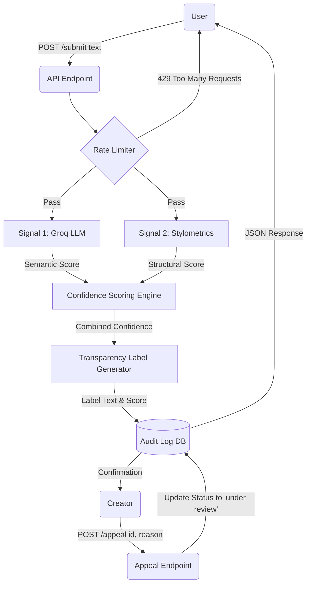

# Provenance Guard: System Specification & Architecture

## 1. Detection Signals
The detection pipeline utilizes two distinct, independent signals to evaluate content. Both signals output a float between `0.0` (Highly likely Human) and `1.0` (Highly likely AI).

* **Signal 1: LLM-Based Classification (Groq `llama-3.3-70b-versatile`)**
    * **What it measures:** Semantic coherence, emotional tone, and the presence of common AI tropes (e.g., highly predictable transitions, neutral safety-driven tone).
    * **Output:** A float `0.0` to `1.0` parsed from the LLM's JSON response.
* **Signal 2: Stylometric Heuristics (Pure Python)**
    * **What it measures:** Structural variance—specifically "burstiness" (the variance in sentence lengths) and type-token ratio (vocabulary diversity). 
    * **Output:** A float `0.0` to `1.0` calculated based on variance thresholds.
* **Combination:** The outputs are combined into a single confidence score using a weighted average formula. Because the LLM is generally more robust at parsing intent, we will heavily weight it: 
    $Confidence = (0.6 \cdot Signal_{LLM}) + (0.4 \cdot Signal_{Stylo})$

## 2. Uncertainty Representation
A confidence score of `0.60` does not mean "AI." It means there is a clash in the signals—for example, the text might have the rigid structure of AI (flagged by Stylometrics) but the colloquial slang of a human (flagged by Groq). Our system respects this uncertainty rather than forcing a binary label.

**Thresholds:**
* **0.00 – 0.35:** High-Confidence Human
* **0.36 – 0.74:** Uncertain
* **0.75 – 1.00:** High-Confidence AI

## 3. Transparency Label Design
Depending on the final confidence score, the API will return one of the following verbatim plain-language labels to surface to the end user:

| Score Range | Transparency Label Text |
| :--- | :--- |
| **0.00 – 0.35** | "Authentic Origin: This content reflects the natural variance and unique structural signatures of human writing." |
| **0.36 – 0.74** | "Uncertain Origin: This content exhibits a mix of human idiosyncrasies and automated patterns. Attribution cannot be definitively confirmed." |
| **0.75 – 1.00** | "Automated Origin: This content closely matches the structural predictability and semantic coherence typical of AI-generated text." |

## 4. Appeals Workflow
* **Who can appeal:** The original creator of the submitted content.
* **Information provided:** The `content_id` of the flagged post and a `reason` (a text string explaining why they believe the system misclassified their work).
* **System Action:** Upon hitting the `POST /appeal` endpoint, the system updates the content's status in the database to `"under review"`. It then logs the creator's `reason` directly into the Audit Log alongside the original classification entry.
* **Reviewer View:** A human moderator checking the audit log will see the raw text, the individual scores from both Signal 1 and Signal 2, the final confidence score, the timestamp, and the user's explicitly stated defense.

## 5. Anticipated Edge Cases
* **Edge Case 1: Academic or Technical Writing.** A highly structured, meticulously researched human essay will lack "burstiness" (sentence length variance) and colloquialisms. The Stylometric signal will likely score this close to `1.0`, dragging the overall confidence score into the "Uncertain" or even "High-Confidence AI" range, resulting in a false positive.
* **Edge Case 2: Prompt-Engineered Persona AI.** If a user prompts Groq to "Write a frantic, grammatically incorrect Reddit rant," the output will exhibit high variance and human-like chaos. Both signals may be fooled, scoring it close to `0.1` and incorrectly labeling it as High-Confidence Human.

---

## Architecture

**Narrative:** When a user submits text via `POST /submit`, it passes through a rate limiter before being processed simultaneously by the Groq LLM (Signal 1) and the Stylometric engine (Signal 2). The Scoring Engine calculates the combined confidence score, generates the appropriate transparency label, logs the entire transaction in the Audit Log, and returns the structured JSON. If a creator contests the result via `POST /appeal`, the system updates the status to "under review" and appends the appeal reasoning directly to the existing audit log entry.

    
---

## AI Tool Plan

Note: AI tools (like Claude/Gemini) will be actively utilized to generate boilerplate code and map out Mermaid architecture diagrams based on the specific prompts and logic bounds outlined below.

**Milestone 3** (Submission endpoint + First signal)

    Inputs provided to AI: The "Detection Signals" section of this spec and the Mermaid Architecture diagram.

    Request: Generate the basic Flask app skeleton, configure the .env Groq client, and write the Python function for signal_1_llm(text) that returns a float between 0.0 and 1.0.

    Verification: I will pass a known human paragraph and a known AI paragraph through the signal_1_llm() function via a local Python script to ensure the LLM returns floats properly before wiring it to the /submit endpoint.

**Milestone 4** (Second signal + Confidence scoring)

    Inputs provided to AI: The "Detection Signals" section, the "Uncertainty Representation" thresholds, and the diagram.

    Request: Generate the signal_2_stylometrics(text) function using pure Python (measuring sentence variance), and the scoring logic that mathematically combines both signals.

    Verification: I will submit a standard AI essay and a highly erratic human text message to verify that the combined scores differ meaningfully and trigger the distinct thresholds (e.g., verifying a 0.6 uncertain score is reachable).

**Milestone 5** (Production layer)

    Inputs provided to AI: The "Transparency Label Design", "Appeals Workflow", and the diagram.

    Request: Implement the label generation logic (mapping the score to the exact strings defined in the spec), implement Flask-Limiter for the /submit endpoint, and create the POST /appeal endpoint that updates the SQLite/JSON audit log.

    Verification: I will purposefully trigger a rate limit to ensure a 429 response is returned, and submit an appeal payload to verify the audit log updates the entry status to "under review".